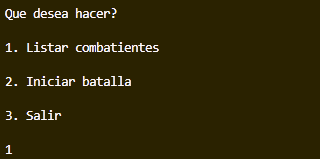
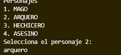
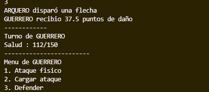
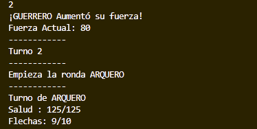
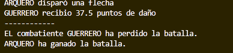

# Act2.Ens-Apr-Sistema-de-personajes-de-videojuego
Diseñar un sistema de clases para representar personajes de un videojuego, organizando correctamente una jerarquía de clases e interfaces que simulen habilidades y comportamientos. Trabajar en pareja usando Git y GitHub para el control de versiones.

# Webgrafía utilizada

    - Stackoverflow
    - Teoria UT6
    - Gitub

# Herramientas utilizadas

     - Visual Studio Code

    
# Requisitos para su uso

    - Visual Studio Code
    - Jdk-23

# Estructura de carpetas

Para este proyecto nos centraremos en las carpetas contenidas en el source (src)

Interfaces: 

En ella guardamos las interfaces ha añadir a las clases específicas de las combatientes

    
Main:

Contiene la clase principal donde se hace las llamadas a los métodos y se crean los objetos

    
Model:

Contiene las clases para la creación de los combatientes, la lógica del juego y la del combate

# Prestaciones del proyecto

Menu de inicio

Muestra las opciones disponibles para seleccionar, las cuales son: 

Opción de listado de personajes

    Muestra un listado de los estadísticas de los personajes y sus habilidades

Opción de simulación de batalla

    Inicia una batalla PVP en la cual se seleccionan dos personajes. Esta finaliza al reducir el valor de salud del rival a 0. 

# Descripción de las clases

## Guerrero 

### Atributos propios:

Fuerza: Se añade al ataque para aumentar el daño del metodo atacar del guerrero

Armadura: Reduce el daño fisico

Escudo: Probabilidad de evitar todo el daño

### Metodos propios:

cargarAtaque(): Aumenta la fuerza del guerrero

defender(): Reduce el daño del siguiente ataque en un %

## Mago

### Atributos propios:

Mana: recurso necesario para lanzar habilidades

Sabiduria: sesu valor se añade al de ataque del mago para su metodo atacar y lanzarHechizo

### Metodos propios:

lanzarHechizo(): inflige daño magico

regenerarMana(): regenera una cantidad grande de mana

## Arquero

### Atributos propios:

Agilidad: aumenta el daño del metodo dispararFlecha

NumFlechas: municion necesaria para usar el metodo de disparar Flechas

### Metodos propios:

reabastecerFlechas() recarga las flechas

dispararFlechas() inflige daño fisico y a distancia, asi que se puede usar mientras se está volando

## Hechicero

### Atributos propios:

Mana: recurso necesario para lanzar habilidades

Concentracion: reducción contra el daño mágico

### Metodos propios:

invocarEntidad(): efecto tipo daño en el tiempo (la entidad hace un ataque al principio del turno) (Este metodo no se pudo implementar como queriamos, asi que en su lugar simplemente llama al metodo lanzarHechizo)

defender(): Reduce el daño del siguiente ataque en un %, el hechicero ademas recupera un % de mana al usar este metodo

## Asesino

### Atributos propios:

Sigilo: probabilidad de obtener un efecto que aumenta la probabilidad de esquivar

Crítico: un valor extra que se añade al metodo atacarPorLaEspalda cuando el asesino esta en sigilo

### Metodos propios:

atacarPorLaEspal0da(): daño critico garantizado, requiere sigilo

ocultar(): otorga sigilo

## Ejemplo de uso

Pongamonos en la piel de dos juegadores nuevos, que desconocen el sistema del juego. Llamemoslos Daniel y Jose.

En primer lugar ninguno de los dos, conoce las habilidades/atributos de cada una de las clases, por lo tanto seleccionarían la opción 1: Listar combatientes

Esto les mostrará en pantalla, una descripción de cada uno de los posibles personajes que podrán escoger en la batalla.

Tras ello, el programa vuelve al menu y nuestros jugadores seleccionan la segunda opción: Iniciar batalla.

Esto les lleva a una nueva selección en la cual se deberá escribir el nombre del personaja para el primer jugador. Para el primer jugador escogeremos el guerrero.

Tras ello, se actualizará la lista de personajes disponibles y se podrá escoger el segundo personaje. En esta ocasión, el arquero.

Una vez escogidos los personajes, se mostrará a los jugadores quien empieza primero (lo cual es decidido aleatoriamente cada turno), más un menu con las opciones disponibles para este. Por ejemplo, ahora comienza el arquero:

Daniel, jugando con el arquero usa la tercera habilidad: Disparar flecha. Esto refleja el daño hecho al guerrero y pasamos a su turno.

Jose, usa su segunda habilidad aumentando la fuerza para su siguiente turno. Además, vemos como se le ha restado una flecha al arquero.

Hagamos un fast-forward hacia el final del combate. Jose ha tenido maña suerte y algunos de sus ataques han fallado. Por lo que Daniel con el arquero le da el golpe de gracia. Finalizado el combate, se nos mostrará el perdedor y el ganador del combate.

## Autores

Daniel Ramos Montoya  
José Antonio Alonso Navarro